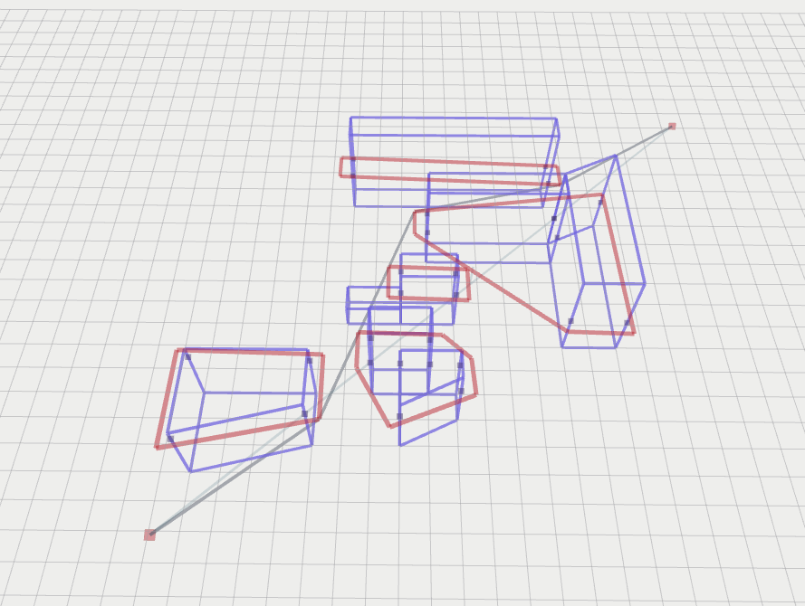
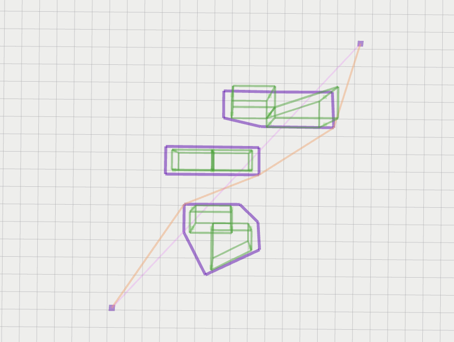
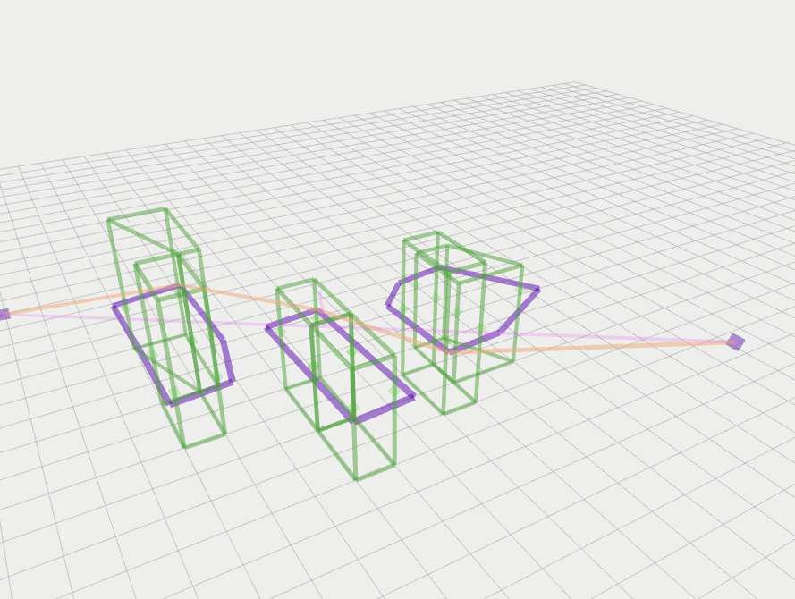

# 3D Visibility Graph Path Planning

## Introduction
3D Visibility Graph`3DVG` serves package to use visibility graph method for path planning in an environment consisting of polygons (2d extrusions for now).

Some benefits in this module
- A submodule consisting of the open source `VisiLibity1` library from https://github.com/karlobermeyer/VisiLibity1
- `get_visibility_path time (11.5621ms)` fast computation for a mapped environment with boundaries
- There are written codes for `graham scan`, `gift_wrapping` and more geometry algorithms that are used to alter and pack the input for the visibility graph to work well with

| perspective1 | perspective2 | perspective3 |
| :--: | :--: | :--: |
| [](media/vis_graph1.png) | [](media/vis_graph2.png) | [](media/vis_graph3.png) |

## Setup
```bash
mkdir -p catkin_ws/src
cd catkin_ws/src
git clone git@github.com:matthewoots/3dvg.git --recurse-submodules
cd ..
catkin build
# To run the module 
source devel/setup.bash
roslaunch visibility_graph sample.launch
```