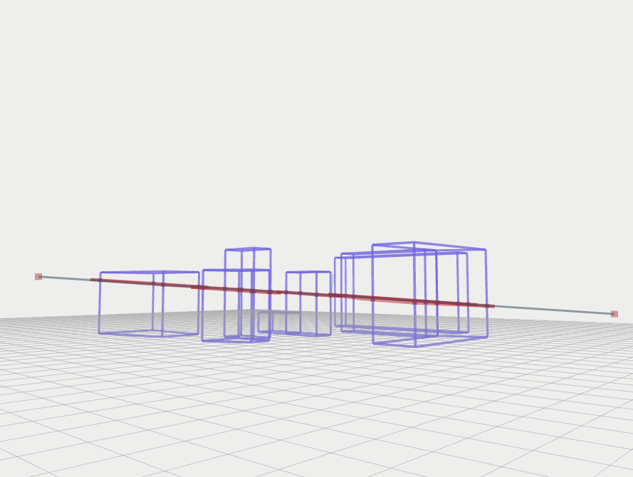
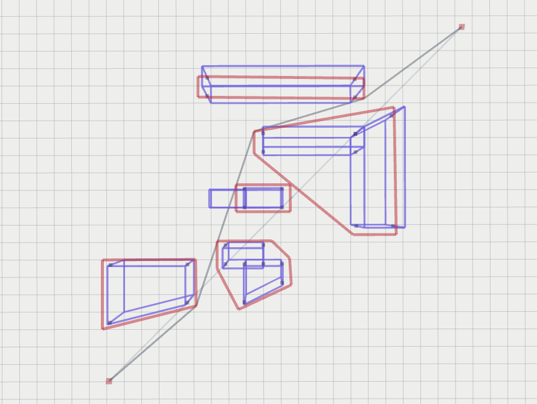

# 3D Visibility Graph Path Planning

## Introduction
3D Visibility Graph `3DVG` serves package to use visibility graph method for path planning in an environment consisting of polygons (2d extrusions for now).

Some benefits in this module
- A submodule consisting of the open source `VisiLibity1` library from https://github.com/karlobermeyer/VisiLibity1
- `get_visibility_path time (11.5621ms)` fast computation for a mapped environment with boundaries
- There are written codes for `graham scan`, `gift_wrapping` and more geometry algorithms that are used to alter and pack the input for the visibility graph to work well with

| perspective1 | perspective2 | perspective3 |
| :--: | :--: | :--: |
| [](media/vis_graph1.png) | [](media/vis_graph2.png) | [](media/vis_graph3.png) |

## Setup
```bash
mkdir -p catkin_ws/src
cd catkin_ws/src
git clone git@github.com:matthewoots/3dvg.git --recurse-submodules
cd ..
catkin build
# To run the module 
source devel/setup.bash
roslaunch visibility_graph sample.launch
```

### Launch file explanation
1. Add in obstacles under this parameter
    - This requires `polygon_vertices_size` to be set first, all polygons will have that number of vertices
    - This will affect the `obstacles` input
    - etc **0-7** represents `xy * 4vertices` **8** represents the height
```xml
<param name="map/polygon_vertices_size" value="4"/>
...
<rosparam param="planning/obstacles"> 
    [2.0, 3.00, 2.00, 7.00, -1.00, 7.00, 0.00, 3.00, 3.00,
    2.0, 0.00, 2.00, -2.00, 0.00, 0.00, 1.00, -2.00, 3.00,
    3.00, 1.00, 2.00, 1.00, 3.00, -1.00, 2.00, -1.00, 4.00,
    5.00, 0.00, 6.00, 0.00, 6.00, 2.00, 5.00, 2.00, 1.00,
    5.00, -2.00, 6.00, -2.00, 6.00, 0.00, 5.00, 0.00, 3.00,
    8.00, -6.00, 9.00, -6.00, 9.00, -1.00, 8.00, -1.00, 4.00,
    4.0, -8.00, 10.00, -8.00, 9.00, -6.00, 4.0, -6.00, 4.00,
    11.00, -6.00, 12.00, -6.00, 12.00, 2.00, 11.00, 2.00, 4.00] 
</rosparam>
```

2. The coordinate frame can be set inside here, this will affect the rotation
```
<param name="map/frame" value="enu"/>
```

3. Set the start and end points
```
<rosparam param="planning/start"> [-4.0, 7.00, 2.75] </rosparam>
<rosparam param="planning/end"> [15.0, -12.0, 1.00] </rosparam>
```

4. Threshold to expand the obstacles so that the agent does not take a path that is not acceptable
```
<param name="planning/protected_zone" value="0.5"/>
```